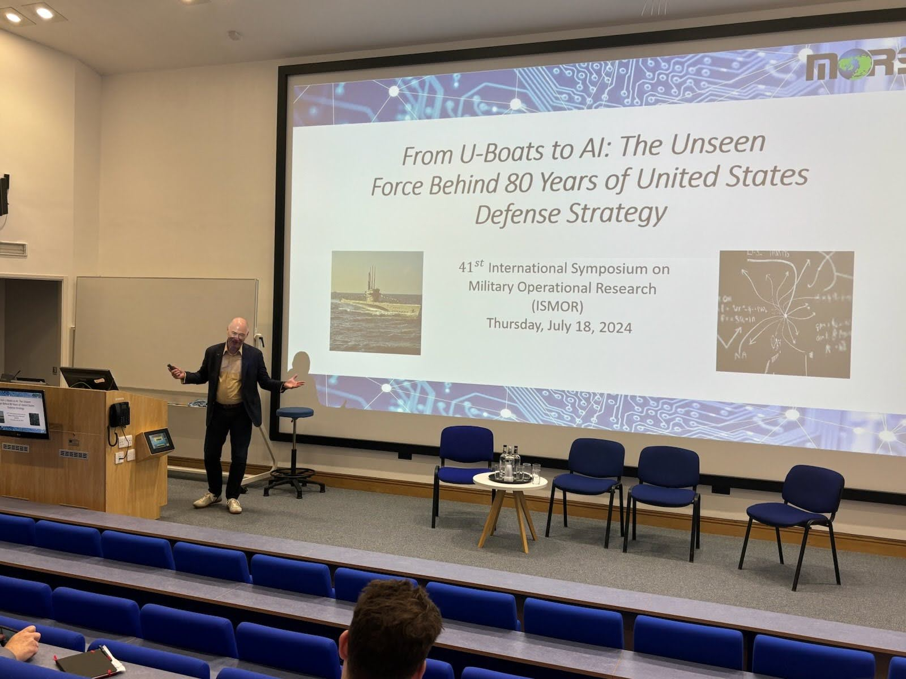
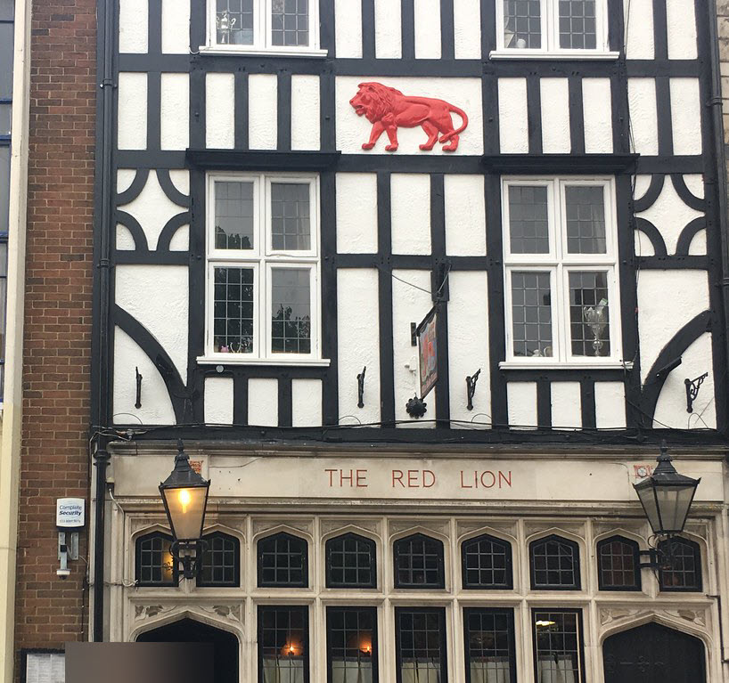
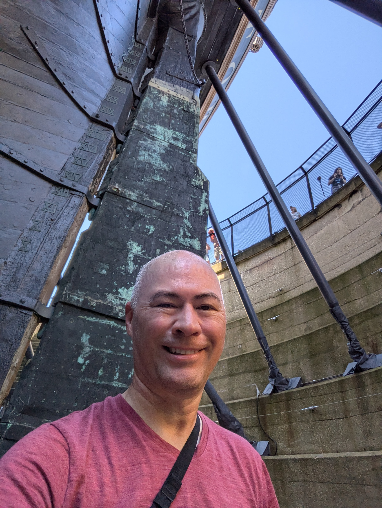
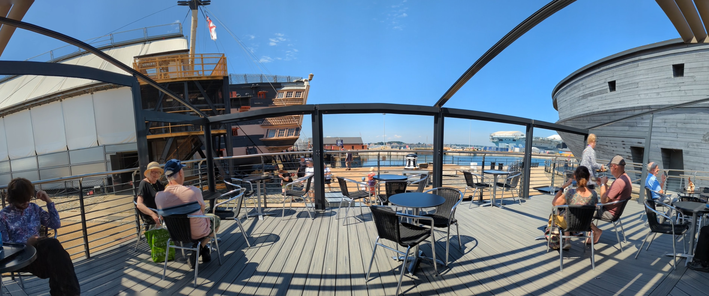

What happens when you combine an American, a very English environment, a military analytics conference, and a healthy dose of pub exploration? Well, it's not quite an episode of "Ted Lasso," but it might be the closest I'll ever get.

This summer, I had the immense pleasure of attending and speaking at the 41st International Symposium on Military Operational Research (ISMOR) in Southampton, UK.  Imagine over 100 military analysts and researchers gathered at the National Oceanography Centre, right on the water's edge. It was a whirlwind of presentations, discussions, and a healthy amount of intrigue as I navigated this unique world.

My presentation covered the past 80 years of how Operations Research has made the difference in supporting the US Department of Defense. Covering 80 years in 20 minutes was no small feat to say the least. I highlighted three very important dates that affected the US military; the all volunteer force in 1973, fall of the Berlin Wall in 1989, and 9/11 in 2001. Obviously, there were many other dates that could have been mentioned time permitting but I thought those three impacted the value of analytics to the US military. A smaller force that has to use technology to fight bigger, the end of the Cold War and the what is next force structure analysis, and finally, the use of analytics to complement high tech innovations such as GPS, drones, and now AI.

### Pubs, History, and a Different Perspective

One of the highlights was undoubtedly the exploration of Southampton's many pubs, some of which have been serving pints since the 1400s! Picture this: low ceilings, cozy fireplaces, and an atmosphere steeped in centuries of history. It was the perfect way to unwind after a day of intense discussions about military strategy and analytics.

The conference itself offered a fresh perspective on military operations research, with presentations not only from the UK but also from numerous NATO partners. Particularly fascinating were the insights from the Swedish Ministry of Defence's analytics group, as they tackled the monumental task of integrating into NATO – a challenge that's both exciting and a little bit daunting.

### Portsmouth and a Ship of Legend

But the adventure didn't end there. After the conference, I ventured to Portsmouth, the home base of the Royal British Navy and the legendary HMS Victory. Now, Victory was undergoing some serious restoration, surrounded by scaffolding like a ship under siege. But that didn't stop me from climbing aboard and even venturing *underneath* the vessel. Yes, you read that right. Underneath! It was a surreal experience, especially after having toured the USS Constitution in Boston earlier this year. The Victory, a Ship of the Line with a whopping 110 guns, dwarfed the Constitution in size and power.

Of course, the Victory is most famous for being Admiral Nelson's flagship during the Battle of Trafalgar. Standing on the very spot where Nelson breathed his last after a 3-hour wait to hear the outcome of the battle was a humbling moment. 

### A Ted Lasso-esque Takeaway?

So, was this a "Ted Lasso" situation? Not quite. There were no biscuits involved (though plenty of English tea!). But it was an experience filled with unexpected discoveries, cultural immersion, and a newfound appreciation for the global community of military operations research. 

And who knows, maybe I'll even try my hand at coaching a soccer team next.
