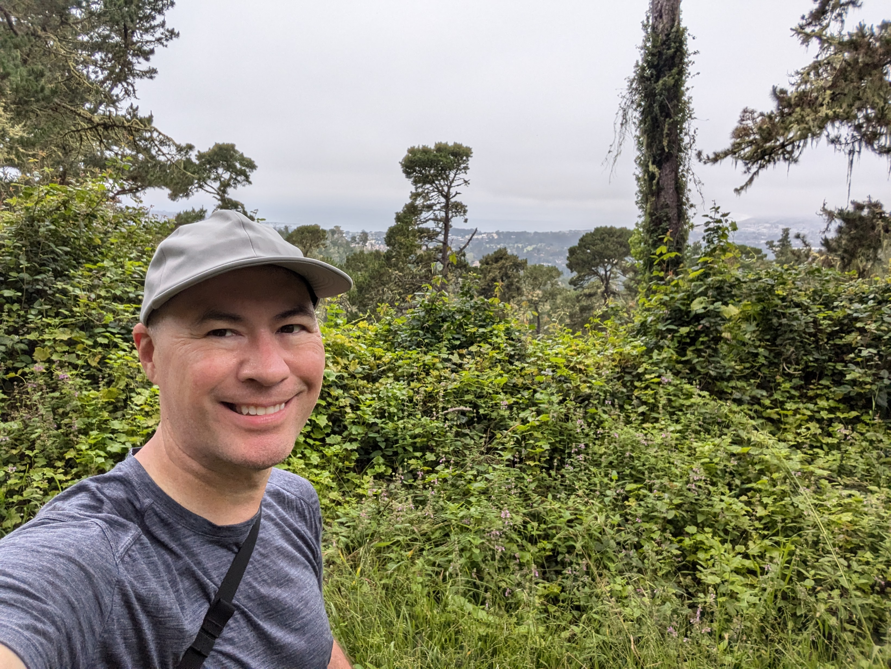

## 

The 92nd Military Operations Research Society (MORS) Symposium held in Monterey was an experience that far exceeded my expectations. As someone who spent their last Navy tour at the Naval Postgraduate School, returning to the stunning scenery of Monterey was a treat in itself. But the symposium, held over four days in June, offered far more than just a scenic backdrop.

### Board Meetings and Ethical Discussions

My MORS journey began a few days early with the Board of Directors Meeting. It was truly exciting to see my colleague Nick Ulmer, a fellow colleague at CANA, elected as President Elect. Nick is set to become MORS' 60th president next year – a remarkable achievement!

Following the board meeting, the main event kicked off. I was honored to contribute to a special session on Ethics in Analytics. The room was packed (we even had to upgrade to a larger space!), which speaks volumes about the relevance of this topic in today's environment.  We had some truly insightful discussions about the use of AI and how even junior analysts can face ethical dilemmas sooner than they might realize.

### Knowledge, Networking, and a Night at the Aquarium

The rest of the week was a whirlwind of fascinating sessions and keynote speakers. One standout moment was the Awards Gala, hosted at the breathtaking Monterey Bay Aquarium.  Dining while surrounded by sharks and other marine life was a truly surreal experience.

Of course, I made sure to take advantage of my free time to explore the Monterey area. I enjoyed a scenic hike and even made a day trip to Santa Cruz to soak in the boardwalk atmosphere and indulge in some delicious ice cream.

### The Takeaway

Overall, the 92nd MORS Symposium was a highlight of my summer. It was a perfect blend of new ideas, reconnecting with old acquaintances, and forging new connections. Monterey, as always, was the perfect host city, and the symposium itself provided an invaluable opportunity for professional development and personal enjoyment. 

I'm already looking forward to the next MORS event in October in Germany!
 

