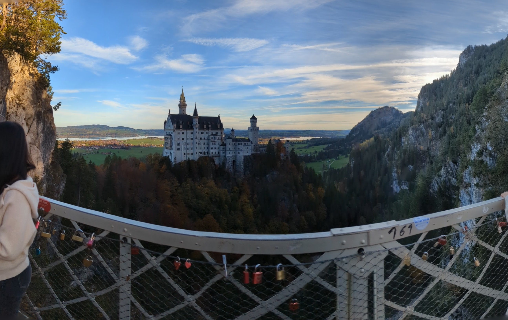
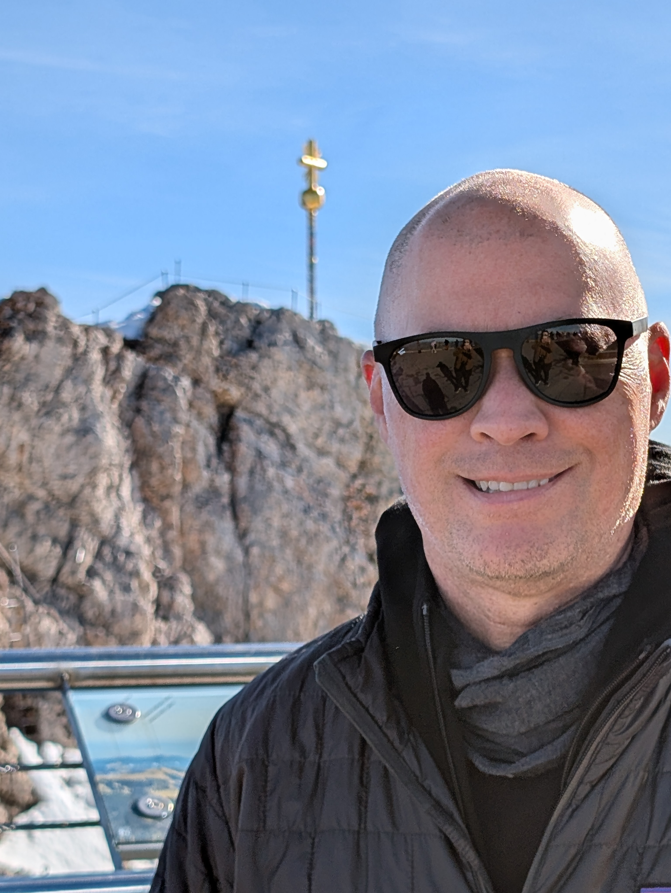
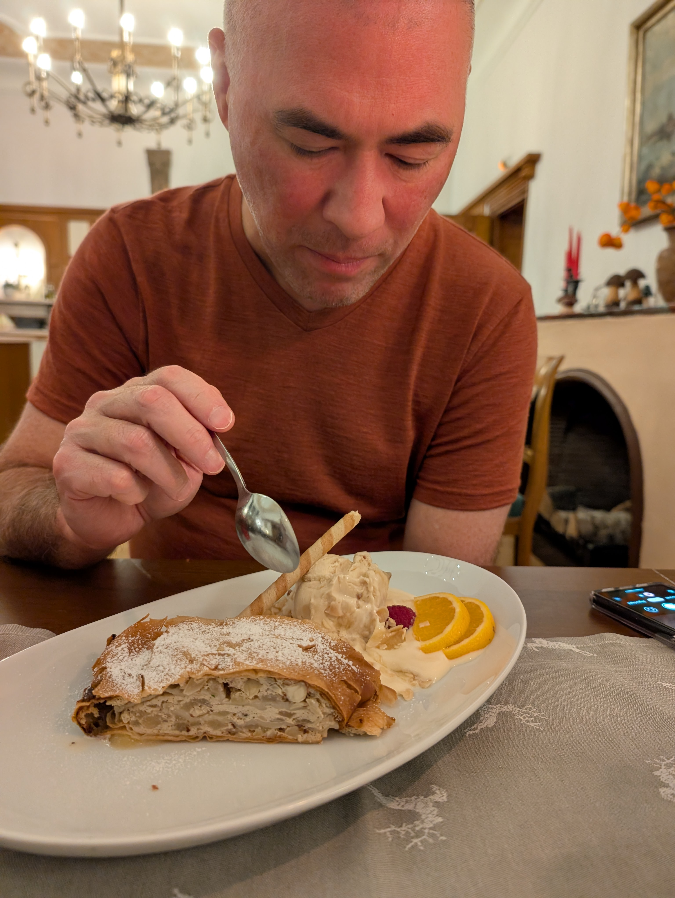

I finally took my first real trip to Germany in October, and let me tell you, it was an absolute whirlwind of history, culture, and some seriously delicious food. Forget just flying through – this time, I got to dive headfirst into the heart of Bavaria!

## Munich Madness

My adventure kicked off in Munich, where I wandered through the charming old town, soaking up the city's rich history on a walking tour. But hold on – history buffs aren't the only ones who'll love Munich. I even stumbled upon a park with a standing wave for surfing! Talk about unexpected.

## Autobahn Dreams

Next stop: Strasbourg! Now, here's where things got really exciting. I finally got to fulfill a lifelong dream and put the pedal to the metal on the legendary Autobahn. Okay, I only hit 110 mph (safety first, people!), but the sheer thrill of that open road was incredible. Plus, the whole experience was surprisingly organized – those Germans really know how to do efficiency!

Strasbourg itself was a fascinating blend of French, German, and Alsatian cultures and the home of the DeGranges. We explored the city by foot and by boat, and even delved into its complex history at a local museum. And oh boy, the food! Let's just say my taste buds were on a delightful international adventure.

## Fairytale Castles and Majestic Mountains

Back in Germany, we stepped straight into a fairytale. Picture this: magnificent castles perched on hilltops, whispering tales of King Ludwig II and his royal family. It was like stepping back in time to the end of the 19th century – a true history lover's dream.

Our final destination was Garmisch, a picturesque town nestled at the foot of the German Alps. While I was there for a conference, we arrived early to conquer some epic hiking trails and soak up those breathtaking alpine views. And trust me, the views from the highest point in Germany were nothing short of awe-inspiring.

But the adventure didn't stop there. We also ventured into the Partnach Gorge, a stunning canyon with crystal-clear blue water that took my breath away.

## Food, Glorious Food

Now, let's talk about the important stuff: food. Bavaria is a foodie's paradise, especially if you're a fan of sausages, pretzels, and beer (and let's be honest, who isn't?). I made it my personal mission to sample all the local delicacies, and I can confidently say my taste buds were singing with joy.

## Bavaria: You Had Me at "Guten Tag!"

If you're looking for a vacation filled with history, culture, stunning scenery, and mouthwatering food, look no further than Bavaria. This region truly has it all, and I can't recommend it enough.