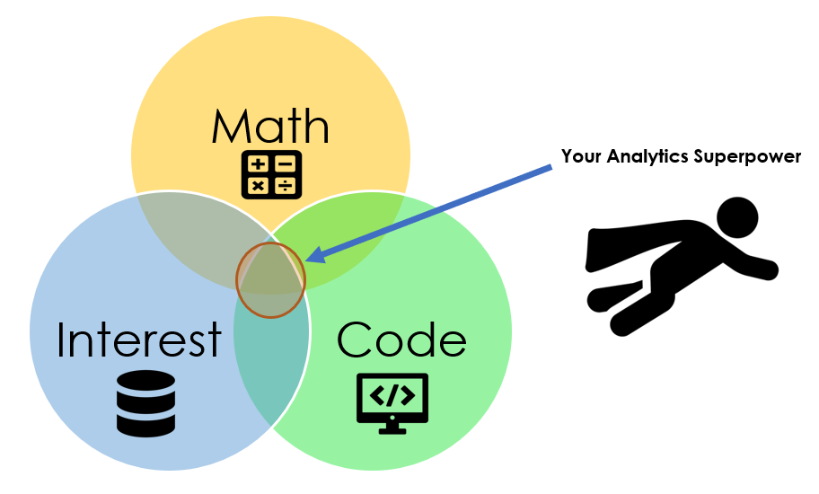

What is your analytics superpower? Perhaps you have never thought about this. I attend a lot of conferences and have seen many presentations over the years. The most exciting analytics briefs were ones that covered a topic that was of extreme interest to the presenter/analyst, whether it was using optimization to determine the best tee time to request considering course usage and weather or using machine learning to perform textual sentiment analysis to determine if fans like the new hometown team's name, both the presenters and the briefs were very engaging. 

The reason for this was that the presenter/analyst was fully engaged in the analysis and had a personal interest in the topic. Perhaps these lucky few stumbled upon the process that I am going to present to you below.

## Analytics

First, we must define what we mean by analytics. I tend to frame analytics as a combination of data and context through math to create insights. 

## Interests

Second, we will identify your interests. Just answer the following question, what do you enjoy doing? Is it watching European Football (a.k.a. soccer), or hiking, or cross-stitching, or perhaps read poetry. After you identify your interest, that will lead you to the research question. What do you want to learn about your interest? Maybe it is the effectiveness of a particular sports team line-up, or the average trail usage at a nearby park, or the popularity of different cross-stitching patterns, or the frequency of certain combinations of words used in your favorite poet's poems. Whatever it is, there is guaranteed to be an open-source data set somewhere on the internet. 

## Approach

Third, you identify the analytics approach or math that you will use to provide the insight. Perhaps you have wanted to learn a new technique. This is an excellent time to learn something new. You can also use something that you are comfortable with and have used in the past. Perhaps you want to learn a new programming language or software tool.

## Putting It All Together

The last step is the magical step that will reinforce and allow your research to motivate the world. Share your project with others. This could be through a Github Repo, or a blog post, or a LinkedIn post, or a presentation at a local MeetUp.com event. You could also record your presentation and post it to YouTube. The options are endless. Why is this last step so important even if only one person (more than likely your Mom) attends your brief, reads your blog post, or watches your YouTube video? This provides proof that you can deliver analytics. It also more than likely makes you the world's leading expert in whatever you were researching. You can do a Google search to verify if you would like. And finally, this provides positive feedback to you that you can do analytics.

For extra credit, you can list this project on your CV or LinkedIn page with a link to the Git Repo and invite others to participate. Collaborating through your work will create lifelong connections that can help your career in analytics. 