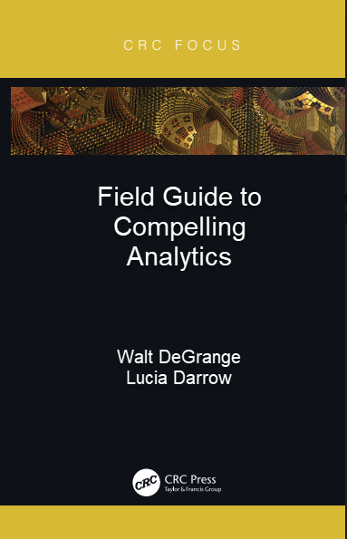

I'm excited to announce I have a book being released this summer. It is the first book for both myself and co-author Lucia Darrow. The book is titled the Field Guide to Compelling Analytics. It focuses on the traits that are important to individual analytics professionals. We both felt that most analytics books concentrate on the organization or more experienced analytics professionals. We think our book is the perfect manual for anyone starting in the field or who wants to level up their analytics game.

