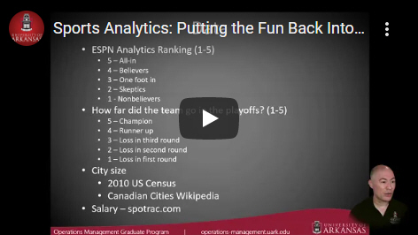
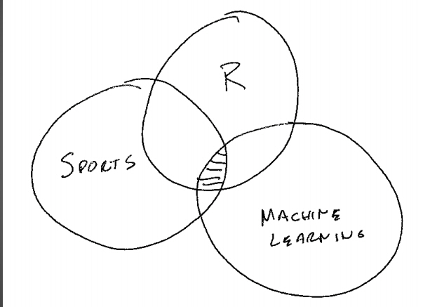

In November 2020, I got the chance to share my sports analytics research during the Master of Science in Operations Managment's Lunch and Learn series. This hobby project started in 2015 when I wanted to learn more about R, sports analytics, and machine learning. 

The data consists of the [ESPN Great Analytics Rating in 2015](http://www.espn.com/espn/feature/story/_/id/12331388/the-great-analytics-rankings), [Spotrac.com](Spotrac.com) salary information, and the results for each MLB, NFL, NBA, and NHL team from 2014-2019. Everyone is invited to participate via my [GitHub repo](https://github.com/ltwalt/espnsports). All the data and R code is available for collaboration.